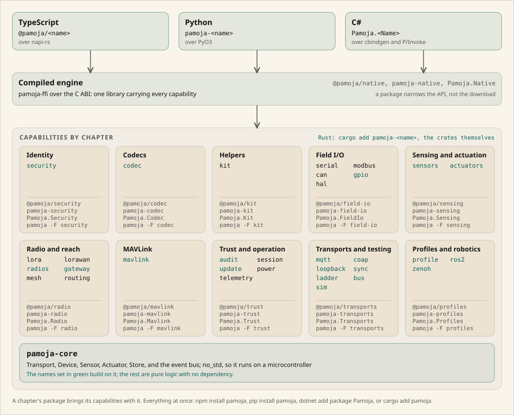

<div align="center">


**One memory-safe Rust core. Every language. For the devices that change lives.**

<a href="https://crates.io/crates/pamoja"></a>
&nbsp;<a href="https://www.npmjs.com/package/pamoja"></a>
&nbsp;<a href="https://pypi.org/project/pamoja/"></a>
&nbsp;<a href="https://www.nuget.org/packages/Pamoja"></a>
&nbsp;<a href="https://github.com/molexxxx/pamoja/actions/workflows/ci.yml"></a>
&nbsp;<a href="LICENSE-MIT"></a>

<a href="https://pamoja.molex.cloud/docs/"></a>
&nbsp;<a href="https://pamoja.molex.cloud/docs/reference/index.html"></a>
&nbsp;<a href="https://pamoja.molex.cloud/docs/examples.html"></a>
&nbsp;<a href="https://pamoja.molex.cloud"></a>
&nbsp;<a href="https://pamoja.molex.cloud/dashboard"></a>

</div>

pamoja is an SDK for IoT, robotics, and drones: one Rust engine with idiomatic
bindings for TypeScript, Python, and C#. Every capability is a crate in Rust and
a package in each binding, and the same concepts work the same way in all four
languages. Most of it is `no_std`, so the same code runs on a gateway and on a
microcontroller.

It is built for the hard environment first: cheap and salvageable hardware, weak
or no connectivity, solar power. Offline-first store-and-forward, compact codecs,
long-range radio, and power-aware scheduling are first-class, and all of it can be
built and tested with nothing plugged in.

## Install

```sh
cargo add pamoja                 # Rust
npm install pamoja               # TypeScript and Node
pip install pamoja               # Python
dotnet add package Pamoja        # C# and .NET
```

That is the whole framework. Every registry offers three grain sizes, so a
project can take less:

| What you want | Rust | npm | PyPI | NuGet |
| --- | --- | --- | --- | --- |
| Everything | `pamoja` | `pamoja` | `pamoja` | `Pamoja` |
| A domain, six of them | `pamoja --features radio` | `@pamoja/radio` | `pamoja-radio` | `Pamoja.Radio` |
| One capability, thirty | `pamoja-lora` | `@pamoja/lora` | `pamoja-lora` | `Pamoja.Lora` |

In Rust that decides what gets compiled, and a Modbus-only build carries three
crates and no third-party code at all. In the bindings it decides what you
import, because one compiled engine sits under every package. The
[install page](https://pamoja.molex.cloud/docs/install.html) measures both.

## First example

A reading taken off a wire on a field node, sent over a link, and checked on the
gateway that receives it, with nothing plugged in and nothing running. Each of
these is spliced from a test that runs in CI.

<details open>
<summary><b>Rust</b></summary>

<!-- snippet: examples/tests/guides/quickstart.rs#example -->
From [`examples/tests/guides/quickstart.rs`](https://github.com/molexxxx/pamoja/blob/main/examples/tests/guides/quickstart.rs):

```rust
use pamoja_codec::{decode_deltas, encode_deltas};
use pamoja_core::Transport;
use pamoja_kit::Smoother;
use pamoja_loopback::{LoopbackBroker, LoopbackTransport};
use pamoja_security::{DeviceIdentity, PublicIdentity};
use pamoja_sensors::ds18b20::{temperature_from_celsius, Resolution, Scratchpad};

// The link. A loopback broker stands in for MQTT or CoAP, so this runs with no network
// and nothing listening. Point the node at a real transport and nothing below changes.
let broker = LoopbackBroker::new();
let mut node = LoopbackTransport::new(broker.clone());
let mut gateway = LoopbackTransport::new(broker);
node.connect().await.expect("the node connects");
gateway.connect().await.expect("the gateway connects");
let topic = "sensors/1/temperature";
gateway.subscribe(topic).await.expect("the gateway listens");

// The device's identity is provisioned once and never leaves it. The gateway is told
// only the public half, which is how it recognises this device later.
let device = DeviceIdentity::from_seed(&[7u8; 32]);
let known = PublicIdentity::from_bytes(&device.public().to_bytes()).expect("a valid key");
println!("gateway trusts device {}", known.fingerprint());

// A stand-in for the thermometer. On a running node these nine bytes arrive from the
// 1-Wire bus; here the library builds what a part at 25.0625 C would send.
let off_the_bus = Scratchpad::new(
    temperature_from_celsius(25.0625, Resolution::Bits12),
    Resolution::Bits12,
    75,
    -10,
)
.to_bytes();

// On the node. The part checksums every read, so a value mangled on a long run is an
// error rather than a plausible temperature a couple of degrees off.
let celsius = Scratchpad::parse(&off_the_bus)
    .expect("the thermometer's checksum matches")
    .temperature_celsius();
println!("read      {celsius:.4} C");

// Readings jitter, so smooth them, and send a batch rather than one at a time.
// Successive readings differ by very little, so the differences cost a fraction of
// what the readings would on a link that charges by the byte.
let mut smoother = Smoother::new(0.5);
let batch: Vec<i64> = [celsius, celsius + 0.5, celsius + 0.4]
    .into_iter()
    .map(|sample| (smoother.update(sample) * 100.0).round() as i64)
    .collect();
let packed = encode_deltas(&batch);
let (readings, bytes) = (batch.len(), packed.len());
println!("packed    {readings} readings into {bytes} bytes");

// Sign the batch and send it. The signature travels with the payload as one message,
// so there is nothing to keep together and split correctly at the far end.
let message = device.sign_message(&packed);
node.send(topic, &message)
    .await
    .expect("the node publishes");

// On the gateway. Verifying returns the payload, so a reading that was altered on the
// way, or signed by some other device, never reaches the code that unpacks it.
let received = gateway
    .recv()
    .await
    .expect("a delivery")
    .expect("a message");
match known.verify_message(&received.payload) {
    Ok(payload) => {
        let readings = decode_deltas(payload).expect("a valid batch");
        println!("gateway   accepted {readings:?} in hundredths of a degree");
    }
    Err(error) => println!("gateway   rejected the reading: {error}"),
}
```
<!-- end -->

</details>

<details>
<summary><b>TypeScript</b></summary>

<!-- snippet: bindings/node/guides/quickstart.ts#example -->
From [`bindings/node/guides/quickstart.ts`](https://github.com/molexxxx/pamoja/blob/main/bindings/node/guides/quickstart.ts):

```typescript
import { packSamples, unpackSamples } from '@pamoja/codec'
import { Smoother } from '@pamoja/kit'
import { LoopbackBroker } from '@pamoja/loopback'
import { DeviceIdentity, fingerprint, verifyMessage } from '@pamoja/security'
import { ds18b20 } from '@pamoja/sensors'

// The device's identity is provisioned once and never leaves it. The gateway is told only
// the public half, which is how it recognises this device later.
const SEED = Buffer.alloc(32, 7)
const TOPIC = 'sensors/1/temperature'

async function main(): Promise<Buffer> {
  // The link. A loopback broker stands in for MQTT or CoAP, so this runs with no network
  // and nothing listening. Point the node at a real transport and nothing below changes.
  const broker = new LoopbackBroker()
  const node = broker.link()
  const gateway = broker.link()
  await node.connect()
  await gateway.connect()
  await gateway.subscribe(TOPIC)

  const device = DeviceIdentity.fromSeed(SEED)
  const known = device.publicKey()
  console.log(`gateway trusts device ${fingerprint(known)}`)

  // A stand-in for the thermometer. On a running node these nine bytes arrive from the
  // 1-Wire bus; here the library builds what a part at 25.0625 C would send.
  const offTheBus = ds18b20.buildScratchpad(25.0625, 12, 75, -10)

  // On the node. The part checksums every read, so a value mangled on a long run is an
  // error rather than a plausible temperature a couple of degrees off.
  const celsius = ds18b20.parseScratchpad(offTheBus).microCelsius / 1e6
  console.log(`read      ${celsius.toFixed(4)} C`)

  // Readings jitter, so smooth them, and send a batch rather than one at a time.
  // Successive readings differ by very little, so the differences cost a fraction of what
  // the readings would on a link that charges by the byte.
  const smoother = new Smoother(0.5)
  const batch = [celsius, celsius + 0.5, celsius + 0.4].map((sample) =>
    Math.round(smoother.update(sample) * 100),
  )
  const packed = packSamples(batch)
  console.log(`packed    ${batch.length} readings into ${packed.length} bytes`)

  // Sign the batch and send it. The signature travels with the payload as one message, so
  // there is nothing to keep together and split correctly at the far end.
  await node.send(TOPIC, device.signMessage(packed))

  // On the gateway. Verifying returns the payload, so a reading that was altered on the
  // way, or signed by some other device, never reaches the code that unpacks it.
  const received = await gateway.recv()
  const payload = verifyMessage(known, received!.payload)
  if (payload === null) {
    console.log('gateway   rejected the reading')
  } else {
    console.log(`gateway   accepted ${unpackSamples(payload).join(', ')} in hundredths of a degree`)
  }

  return received!.payload
}

main()
```
<!-- end -->

</details>

<details>
<summary><b>Python</b></summary>

<!-- snippet: bindings/python/guides/quickstart.py#example -->
From [`bindings/python/guides/quickstart.py`](https://github.com/molexxxx/pamoja/blob/main/bindings/python/guides/quickstart.py):

```python
import asyncio

from pamoja import sensors
from pamoja.codec import pack_samples, unpack_samples
from pamoja.kit import Smoother
from pamoja.loopback import LoopbackBroker
from pamoja.security import DeviceIdentity, fingerprint, verify_message

# The device's identity is provisioned once and never leaves it. The gateway is told only
# the public half, which is how it recognises this device later.
SEED = bytes([7]) * 32
TOPIC = "sensors/1/temperature"


async def main() -> bytes:
    # The link. A loopback broker stands in for MQTT or CoAP, so this runs with no network
    # and nothing listening. Point the node at a real transport and nothing below changes.
    broker = LoopbackBroker()
    node = broker.link()
    gateway = broker.link()
    await node.connect()
    await gateway.connect()
    await gateway.subscribe(TOPIC)

    device = DeviceIdentity.from_seed(SEED)
    known = device.public_key
    print(f"gateway trusts device {fingerprint(known)}")

    # A stand-in for the thermometer. On a running node these nine bytes arrive from the
    # 1-Wire bus; here the library builds what a part at 25.0625 C would send.
    off_the_bus = sensors.ds18b20.build_scratchpad(25.0625, 12, 75, -10)

    # On the node. The part checksums every read, so a value mangled on a long run is an
    # error rather than a plausible temperature a couple of degrees off.
    celsius = sensors.ds18b20.parse_scratchpad(off_the_bus).micro_celsius / 1e6
    print(f"read      {celsius:.4f} C")

    # Readings jitter, so smooth them, and send a batch rather than one at a time.
    # Successive readings differ by very little, so the differences cost a fraction of
    # what the readings would on a link that charges by the byte.
    smoother = Smoother(0.5)
    batch = [
        round(smoother.update(sample) * 100)
        for sample in (celsius, celsius + 0.5, celsius + 0.4)
    ]
    packed = pack_samples(batch)
    print(f"packed    {len(batch)} readings into {len(packed)} bytes")

    # Sign the batch and send it. The signature travels with the payload as one message,
    # so there is nothing to keep together and split correctly at the far end.
    await node.send(TOPIC, device.sign_message(packed))

    # On the gateway. Verifying returns the payload, so a reading that was altered on the
    # way, or signed by some other device, never reaches the code that unpacks it.
    received = await gateway.recv()
    payload = verify_message(known, received.payload)
    if payload is None:
        print("gateway   rejected the reading")
    else:
        print(f"gateway   accepted {unpack_samples(payload)} in hundredths of a degree")

    return received.payload


message = asyncio.run(main())
```
<!-- end -->

</details>

<details>
<summary><b>C#</b></summary>

<!-- snippet: bindings/dotnet/samples/Pamoja.Guides/Quickstart.cs#example -->
From [`bindings/dotnet/samples/Pamoja.Guides/Quickstart.cs`](https://github.com/molexxxx/pamoja/blob/main/bindings/dotnet/samples/Pamoja.Guides/Quickstart.cs):

```csharp
byte[] seed = new byte[DeviceIdentity.KeyLength];
Array.Fill(seed, (byte)7);

// The link. A loopback broker stands in for MQTT or CoAP, so this runs with no
// network and nothing listening. Point the node at a real transport and nothing
// below changes.
using var broker = new LoopbackBroker();
using LoopbackTransport node = broker.Link();
using LoopbackTransport gateway = broker.Link();
await node.ConnectAsync();
await gateway.ConnectAsync();
await gateway.SubscribeAsync(Topic);

using var device = new DeviceIdentity(seed);
byte[] known = device.PublicKey;
Console.WriteLine($"gateway trusts device {DeviceIdentity.FingerprintOf(known)}");

// A stand-in for the thermometer. On a running node these nine bytes arrive from
// the 1-Wire bus; here the library builds what a part at 25.0625 C would send.
byte[] offTheBus = Ds18b20.BuildScratchpad(25.0625f, 12, 75, -10);

// On the node. The part checksums every read, so a value mangled on a long run is
// an error rather than a plausible temperature a couple of degrees off.
float celsius = Ds18b20.ParseScratchpad(offTheBus).MicroCelsius / 1e6f;
Console.WriteLine($"read      {celsius:F4} C");

// Readings jitter, so smooth them, and send a batch rather than one at a time.
// Successive readings differ by very little, so the differences cost a fraction of
// what the readings would on a link that charges by the byte.
using var smoother = new Smoother(0.5f);
long[] batch =
[
    .. new[] { celsius, celsius + 0.5f, celsius + 0.4f }
        .Select(sample => (long)Math.Round(smoother.Update(sample) * 100)),
];
byte[] packed = Codec.PackSamples(batch);
Console.WriteLine($"packed    {batch.Length} readings into {packed.Length} bytes");

// Sign the batch and send it. The signature travels with the payload as one
// message, so there is nothing to keep together and split correctly at the far end.
await node.SendAsync(Topic, device.SignMessage(packed));

// On the gateway. Verifying returns the payload, so a reading that was altered on
// the way, or signed by some other device, never reaches the code that unpacks it.
TransportMessage? received = await gateway.ReceiveAsync();
byte[]? payload = DeviceIdentity.VerifyMessage(known, received!.Payload);
if (payload is null)
{
    Console.WriteLine("gateway   rejected the reading");
}
else
{
    Console.WriteLine(
        $"gateway   accepted {string.Join(", ", Codec.UnpackSamples(payload))}"
        + " in hundredths of a degree");
}
```
<!-- end -->

</details>

## What it covers

Every capability is a crate over one core, and a package in each binding over
one compiled engine. The [architecture page](https://pamoja.molex.cloud/docs/about/architecture.html)
walks through the drawing.

<a href="https://pamoja.molex.cloud/docs/about/architecture.html"></a>

<!-- table: chapters -->
| Chapter | Guides | Crates |
| --- | --- | --- |
| Identity | [Device identity](https://pamoja.molex.cloud/docs/guides/security.html) | [`pamoja-security`](https://pamoja.molex.cloud/docs/reference/rust/pamoja_security/index.html) |
| Codecs | [Codecs](https://pamoja.molex.cloud/docs/guides/codec.html) | [`pamoja-codec`](https://pamoja.molex.cloud/docs/reference/rust/pamoja_codec/index.html) |
| Helpers | [Helpers](https://pamoja.molex.cloud/docs/guides/kit.html) | [`pamoja-kit`](https://pamoja.molex.cloud/docs/reference/rust/pamoja_kit/index.html) |
| Field I/O | [Serial framing](https://pamoja.molex.cloud/docs/guides/serial.html), [Modbus RTU](https://pamoja.molex.cloud/docs/guides/modbus.html), [CAN and J1939](https://pamoja.molex.cloud/docs/guides/can.html), [I2C, SPI, and GPIO](https://pamoja.molex.cloud/docs/guides/gpio.html) | [`pamoja-serial`](https://pamoja.molex.cloud/docs/reference/rust/pamoja_serial/index.html), [`pamoja-modbus`](https://pamoja.molex.cloud/docs/reference/rust/pamoja_modbus/index.html), [`pamoja-can`](https://pamoja.molex.cloud/docs/reference/rust/pamoja_can/index.html), [`pamoja-gpio`](https://pamoja.molex.cloud/docs/reference/rust/pamoja_gpio/index.html) |
| Sensing and actuation | [Sensor drivers](https://pamoja.molex.cloud/docs/guides/sensors.html), [Actuator drivers](https://pamoja.molex.cloud/docs/guides/actuators.html) | [`pamoja-sensors`](https://pamoja.molex.cloud/docs/reference/rust/pamoja_sensors/index.html), [`pamoja-actuators`](https://pamoja.molex.cloud/docs/reference/rust/pamoja_actuators/index.html) |
| Radio and reach | [LoRa airtime](https://pamoja.molex.cloud/docs/guides/lora.html), [LoRaWAN](https://pamoja.molex.cloud/docs/guides/lorawan.html), [Mesh frames](https://pamoja.molex.cloud/docs/guides/mesh.html), [Routing](https://pamoja.molex.cloud/docs/guides/routing.html) | [`pamoja-lora`](https://pamoja.molex.cloud/docs/reference/rust/pamoja_lora/index.html), [`pamoja-lorawan`](https://pamoja.molex.cloud/docs/reference/rust/pamoja_lorawan/index.html), [`pamoja-mesh`](https://pamoja.molex.cloud/docs/reference/rust/pamoja_mesh/index.html), [`pamoja-routing`](https://pamoja.molex.cloud/docs/reference/rust/pamoja_routing/index.html) |
| MAVLink | [MAVLink](https://pamoja.molex.cloud/docs/guides/mavlink.html) | [`pamoja-mavlink`](https://pamoja.molex.cloud/docs/reference/rust/pamoja_mavlink/index.html) |
| Trust and operation | [Audit log](https://pamoja.molex.cloud/docs/guides/audit.html), [Secured session](https://pamoja.molex.cloud/docs/guides/session.html), [Signed updates](https://pamoja.molex.cloud/docs/guides/update.html), [Power](https://pamoja.molex.cloud/docs/guides/power.html), [Telemetry](https://pamoja.molex.cloud/docs/guides/telemetry.html) | [`pamoja-audit`](https://pamoja.molex.cloud/docs/reference/rust/pamoja_audit/index.html), [`pamoja-session`](https://pamoja.molex.cloud/docs/reference/rust/pamoja_session/index.html), [`pamoja-update`](https://pamoja.molex.cloud/docs/reference/rust/pamoja_update/index.html), [`pamoja-power`](https://pamoja.molex.cloud/docs/reference/rust/pamoja_power/index.html), [`pamoja-telemetry`](https://pamoja.molex.cloud/docs/reference/rust/pamoja_telemetry/index.html) |
| Transports and testing | [MQTT](https://pamoja.molex.cloud/docs/guides/mqtt.html), [CoAP](https://pamoja.molex.cloud/docs/guides/coap.html), [Loopback](https://pamoja.molex.cloud/docs/guides/loopback.html), [Store and forward](https://pamoja.molex.cloud/docs/guides/sync.html), [Transport ladder](https://pamoja.molex.cloud/docs/guides/ladder.html), [Event bus](https://pamoja.molex.cloud/docs/guides/bus.html), [Engine surface](https://pamoja.molex.cloud/docs/guides/transport.html), [Simulators](https://pamoja.molex.cloud/docs/guides/sim.html) | [`pamoja-mqtt`](https://pamoja.molex.cloud/docs/reference/rust/pamoja_mqtt/index.html), [`pamoja-coap`](https://pamoja.molex.cloud/docs/reference/rust/pamoja_coap/index.html), [`pamoja-loopback`](https://pamoja.molex.cloud/docs/reference/rust/pamoja_loopback/index.html), [`pamoja-sync`](https://pamoja.molex.cloud/docs/reference/rust/pamoja_sync/index.html), [`pamoja-ladder`](https://pamoja.molex.cloud/docs/reference/rust/pamoja_ladder/index.html), [`pamoja-bus`](https://pamoja.molex.cloud/docs/reference/rust/pamoja_bus/index.html), [`pamoja-sim`](https://pamoja.molex.cloud/docs/reference/rust/pamoja_sim/index.html) |
| Profiles and robotics | [Device profiles](https://pamoja.molex.cloud/docs/guides/profile.html), [ROS 2 rules](https://pamoja.molex.cloud/docs/guides/ros2.html), [Zenoh keys](https://pamoja.molex.cloud/docs/guides/zenoh.html) | [`pamoja-profile`](https://pamoja.molex.cloud/docs/reference/rust/pamoja_profile/index.html), [`pamoja-ros2`](https://pamoja.molex.cloud/docs/reference/rust/pamoja_ros2/index.html), [`pamoja-zenoh`](https://pamoja.molex.cloud/docs/reference/rust/pamoja_zenoh/index.html) |
| Engine | the traits every capability implements, the C ABI, and the dashboard | [`pamoja-core`](https://pamoja.molex.cloud/docs/reference/rust/pamoja_core/index.html), [`pamoja-ffi`](https://pamoja.molex.cloud/docs/reference/rust/pamoja_ffi/index.html), [`pamoja-dashboard`](https://pamoja.molex.cloud/docs/reference/rust/pamoja_dashboard/index.html) |
| Everything | `cargo add pamoja`: every capability above, behind a feature each | [`pamoja`](https://pamoja.molex.cloud/docs/reference/rust/pamoja/index.html) |
<!-- end -->

## Documentation

Every guide shows the same task in all four languages, and each capability's
page on any registry links to the same capability on the other three.

<!-- table: references absolute -->
| Language | Install | Reference |
| --- | --- | --- |
| Rust | `cargo add pamoja` | [Rust reference](https://pamoja.molex.cloud/docs/reference/rust.html), every crate with its API pages, generated by rustdoc |
| TypeScript | `npm install pamoja` | [TypeScript reference](https://pamoja.molex.cloud/docs/reference/node.html), every package with its API pages, generated by typedoc |
| Python | `pip install pamoja` | [Python reference](https://pamoja.molex.cloud/docs/reference/python.html), every module with its API pages, generated by pdoc |
| C# | `dotnet add package Pamoja` | [C# reference](https://pamoja.molex.cloud/docs/reference/dotnet.html), every package with its API pages, generated by DocFX |
<!-- end -->

- [The guides and the install page](https://pamoja.molex.cloud/docs/).
- [Every example](https://pamoja.molex.cloud/docs/examples.html): each complete
  program and each guide's example in the four languages, all run in CI, with
  the file that runs it.
- [The reference hub](https://pamoja.molex.cloud/docs/reference/index.html),
  which opens the generated API pages for each language.
- [The hardware](https://pamoja.molex.cloud/docs/hardware.html) the drivers were
  written against, the buses and radios the crates implement, and the boards this
  is built and tested on.
- [Why it exists](https://pamoja.molex.cloud/docs/about/why.html),
  [how it is put together](https://pamoja.molex.cloud/docs/about/architecture.html),
  and [which standards it is held to](https://pamoja.molex.cloud/docs/about/standards.html).

## Building and contributing

`cargo build --workspace` and `cargo test --workspace` build and test the engine
and every crate; each binding builds from its own directory. The full layout,
the per-language builds, and how the guide examples are spliced are on the
[building page](https://pamoja.molex.cloud/docs/about/building.html), and
[CONTRIBUTING.md](CONTRIBUTING.md) covers the conventions a change is held to.

## License

MIT. See [LICENSE-MIT](LICENSE-MIT).
